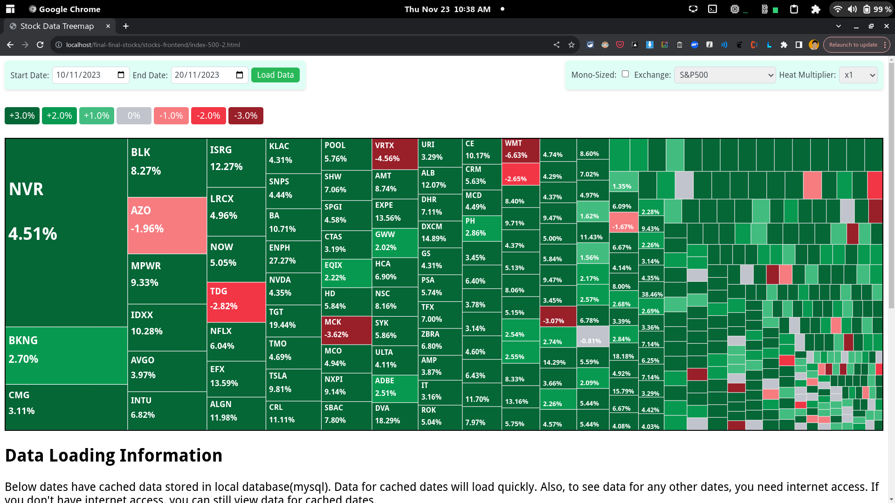

# Stocks Heatmap
Heatmap of changes in stock prices   
uses d3js for heatmap (treemap)  
uses Polygon API, MySQL, PHP at back-end  

#### Weird TechStack and Weird Data handling?
This was made as a project for my college. They had requirements to all of {PHP, MySQL, JS}. I may refactor the design in the future.

#### Skill Issue
I *accidentally* uploaded my API key to the repo. I was having some issues with environment variable in Fedora (seethe)

#### Comeback
I renewed my API key from polygon (cope)
